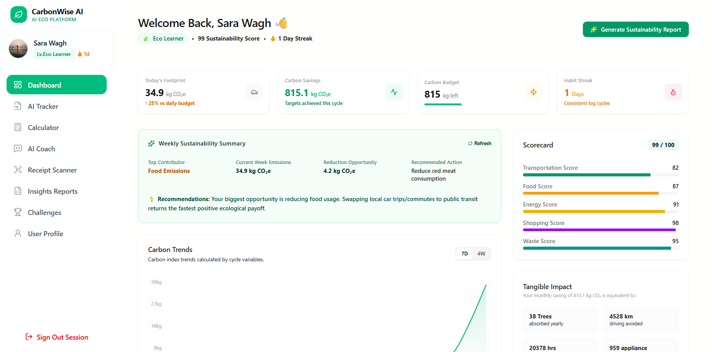
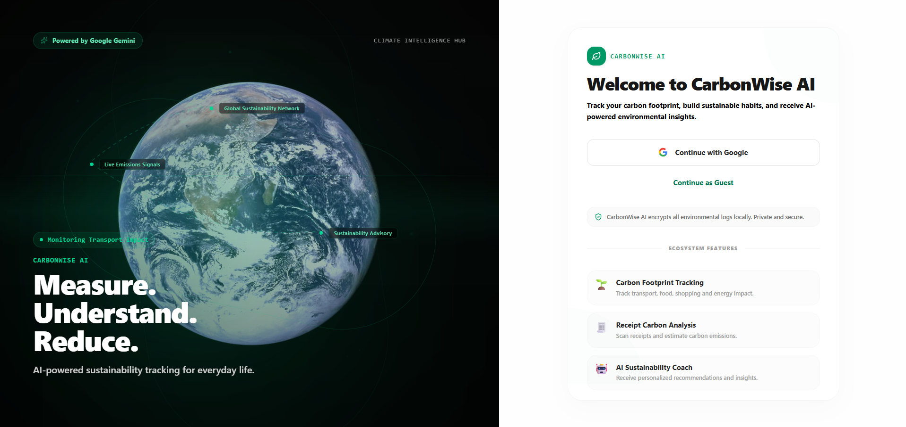
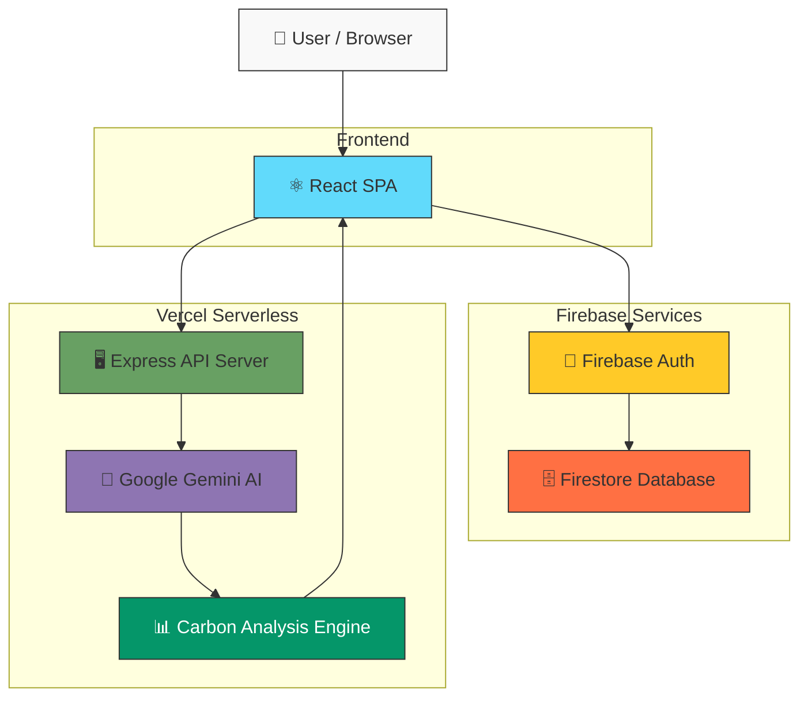

<div align="center">

# 🌍 CarbonWise AI

**AI-powered sustainability platform that transforms receipts, utility bills, travel tickets, and everyday activities into actionable carbon footprint insights.**

[](https://react.dev)
[](https://www.typescriptlang.org/)
[](https://firebase.google.com)
[](https://deepmind.google/technologies/gemini/)
[](https://tailwindcss.com)
[](https://vercel.com)
[](LICENSE)

[**🚀 Live Demo**](https://carbonwise-ai-five.vercel.app) · [**📂 Repository**](https://github.com/sarawagh27/carbonwise-ai)

</div>

---

## 📸 Application Preview

<div align="center">
  <h3>📊 CarbonWise AI Dashboard</h3>
  
  <br><br>
  <h3>🔐 Secure Sign In</h3>
  
</div>

---

## 🎯 Problem Statement

The average person generates **4–8 tonnes of CO₂ annually**, yet most individuals have no practical way to measure, understand, or reduce their personal carbon footprint. Existing sustainability tools are either overly complex, require tedious manual data entry, or fail to provide actionable insights. Environmental data remains fragmented and difficult to interpret for everyday decision-making.

## 💡 Solution

**CarbonWise AI** bridges this gap by combining the multimodal intelligence of **Google Gemini** with real-time data tracking and personalized AI coaching. Users can simply upload a grocery receipt, describe their daily commute in natural language, or chat with an AI sustainability coach — and instantly receive precise carbon footprint calculations, trend visualizations, and actionable recommendations to reduce their environmental impact.

---

## ✨ Core Features

### 📸 AI Receipt Scanner
Upload grocery receipts, utility bills, or travel tickets. **Gemini Vision** automatically extracts purchased items, quantities, and prices, then estimates CO₂ emissions for each item with an AI confidence score and greener alternatives.

### 📊 Carbon Tracking Dashboard
Monitor your environmental impact through real-time **Recharts** data visualizations — daily emission trends, historical timelines, and categorized breakdowns. All data syncs instantly across devices via **Firestore**.

### 🗣️ NLP Activity Tracker
Describe daily activities in plain English (or use voice input). Gemini parses natural language into categorized carbon emissions with scientific explanations — no forms, no dropdowns.

### 🤖 AI Sustainability Coach
Chat with a dedicated AI eco-advisor that references your personal profile and recent activity data to deliver tailored, data-backed sustainability recommendations.

### 🧮 Manual Carbon Calculator
Calculate emissions using precise, scientifically-sourced emission factors across transportation, food, energy, shopping, and waste categories.

### 📋 Sustainability Reports
AI-generated weekly and monthly sustainability reports with trend projections and actionable tips.

### 🏆 Eco Challenges & Gamification
Complete sustainability challenges (Meat-Free Monday, Zero Disposable Plastics, etc.), earn XP, and level up from **Seed** → **Eco Learner** → **Green Guardian** → **Earth Protector** → **Climate Champion**.

### 🔐 Google Authentication
Secure one-click Google Sign-in via **Firebase Authentication** with popup-based flow, browser local persistence, and comprehensive error handling.

### 👤 Guest Mode
Full application experience without sign-in. All data persists locally via `localStorage`, allowing instant exploration of every feature.

### ☁️ Firestore Cloud Sync
Real-time data synchronization with user-scoped Firestore collections. Granular security rules ensure complete data isolation between users.

---

## 🛡️ Technical Challenges Solved

| Challenge | Solution |
|---|---|
| ✅ **Multimodal AI Receipt Analysis** | Gemini Vision with structured JSON schema output for reliable, typed responses |
| ✅ **Firebase Auth on Vercel** | Auto-redirect of Vercel preview URLs to production domain for OAuth compatibility |
| ✅ **User Data Isolation** | Firestore security rules enforcing `request.auth.uid == userId` on all collections |
| ✅ **API Resilience** | Every Gemini endpoint has a comprehensive offline fallback for quota exhaustion and outages |
| ✅ **Carbon Calculation Engine** | Scientifically-sourced emission factors with realistic daily thresholds per category |
| ✅ **Serverless Architecture** | Express API deployed as Vercel serverless functions with SPA routing rewrites |
| ✅ **Production Configuration** | Environment-based config, domain authorization, and secure API key management |

---

## 🧠 AI Decision Logic

CarbonWise AI utilizes **Google Gemini 3.5 Flash** for its reasoning and classification tasks. The system is designed with specific prompt engineering constraints to ensure reliable outputs:

1. **Structured JSON Output**: System prompts strictly require `application/json` format. This eliminates unpredictable chatbot responses and guarantees consistent data parsing for the React UI.
2. **Context Injection**: For the *Eco-Coach*, the AI prompt dynamically injects the user's historical category metrics (e.g., `Transportation: 25kg, Food: 10kg`), forcing the LLM to ground its advice in actual user behavior rather than generic platitudes.
3. **Fallback Mechanisms**: If the AI endpoint fails (e.g., quota limits), the system automatically defaults to a deterministic local math fallback. For instance, the Insights page will calculate the highest emission category natively and display a hardcoded actionable tip, ensuring zero downtime for the user.

---

## 🏗️ System Architecture

<!-- Replace with actual diagram: docs/architecture.png -->



> For a detailed architecture breakdown including data models, auth flows, and API design, see [docs/ARCHITECTURE.md](docs/ARCHITECTURE.md).

---

## 🛠️ Technology Stack

| Layer | Technology | Purpose |
|---|---|---|
| **Frontend** | React 19, TypeScript 5.8 | Component-based UI with type safety |
| **Styling** | Tailwind CSS v4, Framer Motion | Responsive design with micro-animations |
| **Visualization** | Recharts, Lucide React | Data charts and iconography |
| **Backend** | Node.js, Express | API server for AI endpoints |
| **AI Engine** | Google Gemini 3.5 Flash | Multimodal analysis (text, vision, audio) |
| **Database** | Firebase Firestore | Real-time NoSQL document storage |
| **Authentication** | Firebase Auth | Google Sign-in with session persistence |
| **Hosting** | Vercel | Static frontend + serverless API functions |
| **Build Tool** | Vite 6 | Fast development and optimized production builds |

---

## ♿ Accessibility (A11y)

Currently, CarbonWise AI is optimized heavily for visual presentation and layout responsiveness. However, we acknowledge critical areas for improvement in web accessibility to reach full WCAG 2.1 AA compliance:
- **Current State**: Semantic HTML5 elements are used, but ARIA labels are largely missing (only one `aria-label` present in the Sidebar navigation).
- **Planned Improvements**:
  - Implementation of comprehensive `aria-labels` on all interactive dashboard elements and buttons.
  - Adding descriptive `alt` text to Gemini-generated image previews and charts.
  - Improving keyboard navigation (`tabIndex`) for the manual carbon calculator and receipt modal.
  - Implementing high-contrast mode toggles for users with visual impairments.

---

## 🌟 Why This Project Stands Out

This project demonstrates production-level engineering across the full stack:

- **🤖 AI Multimodal Integration** — Receipt vision analysis, NLP parsing, voice transcription, and conversational AI coaching — all powered by a single Gemini integration with structured output schemas.
- **🏗️ Full-Stack Architecture** — React SPA frontend, Express API backend, Firebase database & auth, deployed as Vercel serverless functions.
- **☁️ Production Cloud Deployment** — Live on Vercel with environment-based configuration, domain authorization, and automated preview URL handling.
- **🌍 Real-World Impact** — Addresses a genuine environmental challenge with scientifically-sourced emission factors and actionable sustainability recommendations.
- **🔒 Authentication & Data Isolation** — Firebase Auth with granular Firestore security rules ensuring complete user data privacy.
- **⚡ Resilient Design** — Every AI endpoint includes offline fallback logic, ensuring the application functions even during API outages or quota exhaustion.


---

## 📁 Project Structure

```text
carbonwise-ai/
├── api/
│   └── index.ts                  # Vercel serverless function entry point
├── docs/
│   ├── screenshots/              # Application screenshots
│   ├── ARCHITECTURE.md           # System architecture documentation
│   └── DEPLOYMENT.md             # Deployment guide
├── firebase/
│   ├── applet-config.json        # Firebase applet configuration
│   ├── blueprint.json            # Firebase project blueprint
│   └── firestore.rules           # Firestore security rules
├── src/
│   ├── components/
│   │   ├── CalculatorView.tsx     # Manual carbon calculator
│   │   ├── ChallengesView.tsx     # Eco challenges & gamification
│   │   ├── CoachView.tsx          # AI sustainability coach chat
│   │   ├── DashboardView.tsx      # Main analytics dashboard
│   │   ├── InsightsView.tsx       # AI-generated sustainability reports
│   │   ├── OnboardingView.tsx     # User onboarding wizard
│   │   ├── ProfileView.tsx        # User profile & settings
│   │   ├── ReceiptView.tsx        # AI receipt scanner (Gemini Vision)
│   │   ├── Sidebar.tsx            # Navigation sidebar
│   │   └── TrackerView.tsx        # NLP activity tracker
│   ├── services/
│   │   └── authService.ts         # Firebase authentication service
│   ├── App.tsx                    # Root application component
│   ├── AppContext.tsx             # Global state management (React Context)
│   ├── data.ts                    # Constants, emission factors, calculations
│   ├── firebase.ts                # Firebase configuration & Firestore utilities
│   ├── index.css                  # Global styles (Tailwind entry)
│   ├── main.tsx                   # Application entry point
│   ├── types.ts                   # TypeScript type definitions
│   └── vite-env.d.ts              # Vite environment type declarations
├── .env.example                   # Environment variable template
├── .gitignore                     # Git ignore rules
├── CONTRIBUTING.md                # Contribution guidelines
├── LICENSE                        # MIT License
├── README.md                      # Project documentation
├── firebase.json                  # Firebase CLI configuration
├── index.html                     # HTML entry point
├── package.json                   # Dependencies and scripts
├── server.ts                      # Express backend + Gemini AI API routes
├── tsconfig.json                  # TypeScript configuration
├── vercel.json                    # Vercel deployment configuration
└── vite.config.ts                 # Vite build configuration
```

---

## 🚀 Getting Started

### Prerequisites

- [Node.js](https://nodejs.org/) v18 or later
- A [Firebase Project](https://console.firebase.google.com/) with Firestore and Google Auth enabled
- A [Google Gemini API Key](https://aistudio.google.com/apikey)

### 1. Clone & Install

```bash
git clone https://github.com/sarawagh27/carbonwise-ai.git
cd carbonwise-ai
npm install
```

### 2. Configure Environment

```bash
cp .env.example .env.local
```

Open `.env.local` and fill in your credentials (see [Environment Variables](#-environment-variables) below).

### 3. Run Development Server

```bash
npm run dev
```

The full-stack application will start on `http://localhost:3000`. The Express server integrates with Vite's dev middleware for hot module replacement.

### 4. Build for Production

```bash
npm run build
npm start
```

---

## 🔑 Environment Variables

| Variable | Description | Source |
|---|---|---|
| `GEMINI_API_KEY` | Google Gemini API key (server-side only) | [AI Studio](https://aistudio.google.com/apikey) |
| `VITE_FIREBASE_API_KEY` | Firebase Web API key | Firebase Console → Project Settings → Web App |
| `VITE_FIREBASE_AUTH_DOMAIN` | Firebase auth domain | Firebase Console (format: `project-id.firebaseapp.com`) |
| `VITE_FIREBASE_PROJECT_ID` | Firebase project identifier | Firebase Console → Project Settings |
| `VITE_FIREBASE_STORAGE_BUCKET` | Firebase storage bucket URL | Firebase Console → Project Settings |
| `VITE_FIREBASE_MESSAGING_SENDER_ID` | Firebase Cloud Messaging sender ID | Firebase Console → Project Settings |
| `VITE_FIREBASE_APP_ID` | Firebase application ID | Firebase Console → Project Settings → Web App |

> Variables prefixed with `VITE_` are embedded in the frontend bundle at build time. `GEMINI_API_KEY` is server-side only and never exposed to the client.

---

## 🗺️ Future Roadmap

- 🔍 **Advanced OCR Extraction** — Improved receipt parsing accuracy with multi-language support
- 📈 **Confidence Scoring** — Granular AI confidence metrics for emission estimates
- 📧 **Weekly Email Reports** — Automated sustainability summaries delivered to your inbox
- 📉 **Carbon Forecasting** — Predictive emission modeling based on historical trends
- 📱 **Mobile PWA Support** — Progressive Web App for native-like mobile experience
- 🏅 **Expanded Challenges** — Community-driven sustainability challenge marketplace
- 👥 **Team Dashboards** — Shared sustainability tracking for organizations and groups
- 🌿 **Carbon Offset Integrations** — Connect to verified carbon offset marketplaces

---

## 🤝 Contributing

Contributions, issues, and feature requests are welcome! Please read the [Contributing Guide](CONTRIBUTING.md) before submitting a pull request.

---

## 📜 License

This project is licensed under the **MIT License** — see the [LICENSE](LICENSE) file for details.

Copyright © 2026 [Sara Wagh](https://github.com/sarawagh27)

---

<div align="center">

**Built with 💚 for a sustainable future.**

</div>
