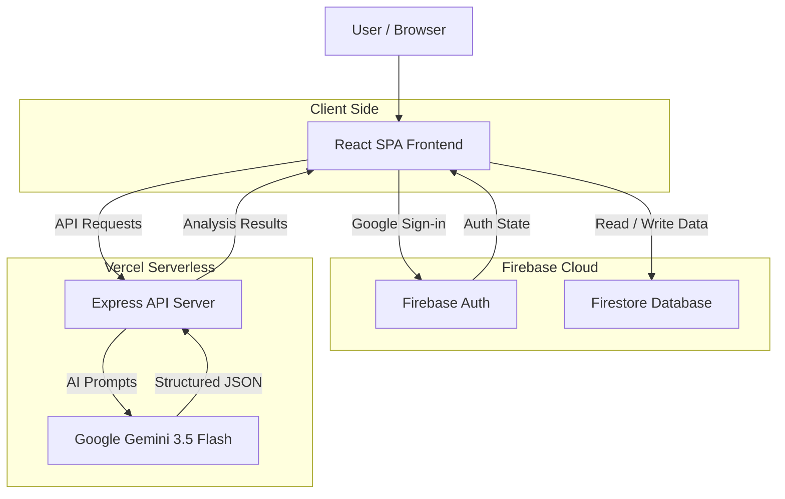
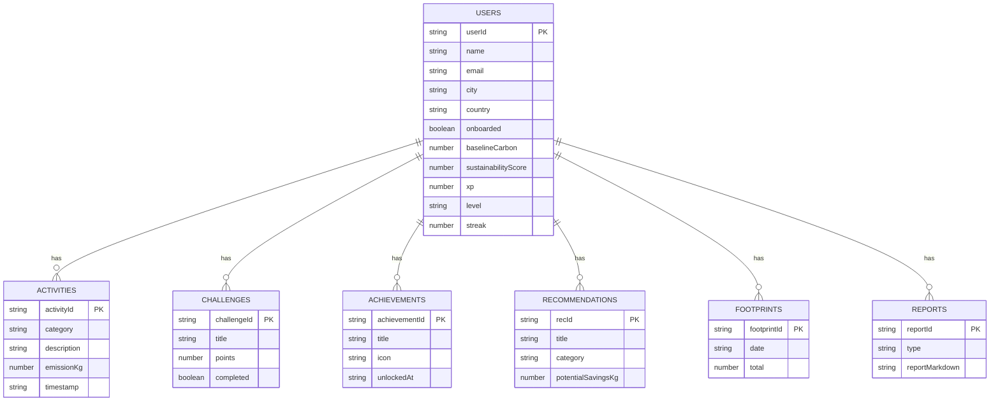
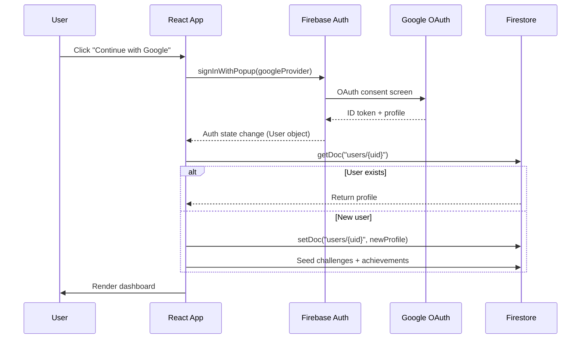

# CarbonWise AI — System Architecture

Comprehensive technical architecture documentation for the CarbonWise AI platform.

---

## Table of Contents

- [System Overview](#system-overview)
- [Architecture Diagram](#architecture-diagram)
- [Frontend Architecture](#frontend-architecture)
- [Backend Architecture](#backend-architecture)
- [AI Integration](#ai-integration)
- [Data Architecture](#data-architecture)
- [Authentication Flow](#authentication-flow)
- [Security Model](#security-model)
- [Deployment Architecture](#deployment-architecture)

---

## System Overview

CarbonWise AI is a full-stack sustainability platform composed of three major layers:

1. **React SPA Frontend** — A single-page application built with React 19 and TypeScript, served via Vite, handling all user interactions, data visualization, and state management.

2. **Express API Backend** — A Node.js Express server exposing AI-powered endpoints that communicate with Google Gemini for carbon analysis, coaching, and report generation. Deployed as Vercel serverless functions.

3. **Firebase Services** — Firebase Authentication handles user identity (Google Sign-in), while Firestore provides real-time NoSQL document storage with user-scoped security rules.

---

## Architecture Diagram



---

## Frontend Architecture

### Technology

| Technology | Purpose |
|---|---|
| React 19 | Component-based UI framework |
| TypeScript 5.8 | Static type checking |
| Tailwind CSS v4 | Utility-first styling |
| Framer Motion | Animations and transitions |
| Recharts | Data visualization (charts, graphs) |
| Lucide React | Iconography |


### State Management

Global application state is managed via **React Context** in `AppContext.tsx`, which provides:

- User authentication state
- Profile data (synced with Firestore)
- Activity logs, challenges, achievements, and recommendations
- Permission states (location, voice, camera, notifications)
- CRUD operations that transparently handle both Firestore (authenticated) and localStorage (guest mode)

### Component Structure

| Component | Responsibility |
|---|---|
| `App.tsx` | Root component, login screen, view routing |
| `DashboardView.tsx` | Analytics dashboard with charts |
| `TrackerView.tsx` | NLP activity tracker with voice input |
| `ReceiptView.tsx` | AI receipt scanner (Gemini Vision) |
| `CoachView.tsx` | AI sustainability coach chat |
| `CalculatorView.tsx` | Manual carbon calculator |
| `InsightsView.tsx` | AI-generated sustainability reports |
| `ChallengesView.tsx` | Eco challenges and gamification |
| `ProfileView.tsx` | User profile and settings |
| `OnboardingView.tsx` | Onboarding questionnaire wizard |
| `Sidebar.tsx` | Navigation sidebar |

---

## Backend Architecture

### Express Server (`server.ts`)

A single Express application that serves both the API and the Vite development middleware:

```
server.ts
├── Gemini AI Client (lazy-initialized singleton)
├── Fallback Functions (offline resilience)
├── API Routes
│   ├── GET  /api/health          → Health check
│   ├── POST /api/gemini/tracker  → NLP activity analysis
│   ├── POST /api/gemini/coach    → AI sustainability coach
│   ├── POST /api/gemini/transcribe → Audio transcription
│   ├── POST /api/gemini/receipt  → Vision receipt scanning
│   └── POST /api/gemini/insights → Report generation
└── Vite Middleware Integration (dev) / Static Serving (prod)
```

### API Endpoints

| Endpoint | Method | Input | Output |
|---|---|---|---|
| `/api/health` | GET | — | Status check |
| `/api/gemini/tracker` | POST | Natural language text | Categorized emissions array |
| `/api/gemini/coach` | POST | Chat messages + profile | AI coaching response |
| `/api/gemini/transcribe` | POST | Audio base64 | Text transcript |
| `/api/gemini/receipt` | POST | Image base64 | Extracted items with emissions |
| `/api/gemini/insights` | POST | Activity history + profile | Report with projections |

### Resilience Pattern

Every API endpoint follows the same resilience pattern:

1. Attempt Gemini API call with timeout (6.5–12 seconds)
2. If Gemini fails (quota, timeout, error) → execute local fallback function
3. Return result to client (user sees no errors)

This ensures the application remains functional even during Gemini API outages or quota exhaustion.

### Serverless Deployment

For Vercel deployment, `api/index.ts` re-exports the Express app:

```typescript
import app from "../server";
export default app;
```

Vercel's `vercel.json` rewrites route all `/api/*` requests to this serverless function, while everything else serves the static SPA.

---

## AI Integration

### Google Gemini 3.5 Flash

All AI features use the `gemini-3.5-flash` model via the `@google/genai` SDK:

| Feature | Modality | Schema |
|---|---|---|
| Activity Tracker | Text → Structured JSON | Emission categories, descriptions, explanations |
| Receipt Scanner | Image → Structured JSON | Items, quantities, emissions, alternatives |
| Audio Transcription | Audio → Text | Verbatim transcription |
| Sustainability Coach | Text → Markdown | Conversational AI with system persona |
| Insights Reports | Text → Structured JSON | Summary, projections, tips, markdown report |

### Structured Output

The tracker, receipt, and insights endpoints use Gemini's **structured output** feature with explicit JSON schemas (`responseMimeType: "application/json"` + `responseSchema`). This ensures type-safe, predictable responses that map directly to TypeScript interfaces.

### Coach Persona

The sustainability coach uses a detailed system instruction that:
- Establishes the "CarbonWise Coach" persona
- Injects the user's profile data (city, diet, transport habits, level, XP, streak)
- References recent activity logs for personalized recommendations

---

## Data Architecture

### Firestore Document Model



### Collection Paths

```
users/{userId}                          → User profile document
users/{userId}/activities/{activityId}  → Carbon activity logs
users/{userId}/challenges/{challengeId} → Eco challenge status
users/{userId}/achievements/{achId}     → Unlocked badges
users/{userId}/recommendations/{recId}  → AI recommendations
users/{userId}/footprints/{footprintId} → Daily footprint summaries
users/{userId}/reports/{reportId}       → Generated reports
```

### Dual Storage Strategy

| Mode | Storage | Sync |
|---|---|---|
| Authenticated | Firestore | Real-time, cross-device |
| Guest | localStorage | Local only, browser-scoped |

`AppContext.tsx` transparently handles both modes — all CRUD operations check `guestMode` and route to the appropriate storage layer.

---

## Authentication Flow



### Key Details

- **Persistence**: Browser local persistence (`browserLocalPersistence`) keeps users signed in across sessions.
- **Observer Pattern**: `onAuthStateChanged` listener reactively updates application state.
- **Vercel Preview Redirect**: `main.tsx` detects non-production Vercel preview URLs and redirects to the production domain to ensure Firebase auth domain authorization works correctly.
- **Error Handling**: `authService.ts` maps every Firebase auth error code to a user-friendly message.

---

## Security Model

### Firestore Security Rules

All data access is restricted to the authenticated user who owns it:

```
rules_version = '2';
service cloud.firestore {
  match /databases/{database}/documents {
    match /users/{userId} {
      allow read, write: if request.auth != null && request.auth.uid == userId;

      match /{subcollection}/{docId} {
        allow read, write: if request.auth != null && request.auth.uid == userId;
      }
    }
  }
}
```

### API Security

- `GEMINI_API_KEY` is server-side only — never exposed in the frontend bundle.
- All `VITE_` prefixed variables are Firebase client config (public by design).
- No direct client-to-Gemini communication — all AI requests are proxied through the Express API.

---

## Deployment Architecture

```
┌─────────────────────────────────────────┐
│              Vercel Platform            │
│                                         │
│  ┌─────────────┐  ┌──────────────────┐  │
│  │ Static SPA  │  │ Serverless API   │  │
│  │ (Vite dist) │  │ (Express app)    │  │
│  │             │  │                  │  │
│  │  /* routes  │  │  /api/* routes   │  │
│  └─────────────┘  └──────────────────┘  │
│                                         │
└─────────────────────────────────────────┘
         │                    │
         ▼                    ▼
┌──────────────┐    ┌──────────────────┐
│ Firebase     │    │ Google Gemini    │
│ Auth + DB    │    │ AI API           │
└──────────────┘    └──────────────────┘
```

### Vercel Routing (`vercel.json`)

```json
{
  "rewrites": [
    { "source": "/api/:path*", "destination": "/api/index" },
    { "source": "/((?!api/).*)", "destination": "/index.html" }
  ]
}
```

- All `/api/*` requests → serverless Express function
- All other requests → SPA `index.html` (client-side routing)

### Build Process

1. `vite build` — Compiles React SPA to static assets in `dist/`
2. `esbuild` — Bundles `server.ts` to `dist/server.cjs` for production Node.js execution
3. Vercel deploys both the static assets and the serverless function entry point
